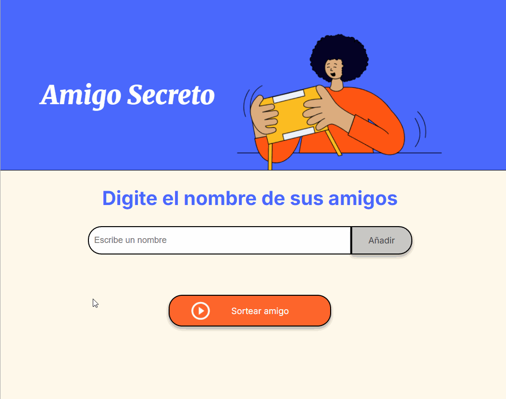

# Juego del Amigo Secreto
Una aplicación web sencilla para sortear a tus amigos y descubrir quién es tu amigo secreto.

## Características
- Entrada de nombres dinámica: los usuarios pueden escribir los nombres de sus amigos en un campo de texto y verlos aparecer en una lista en tiempo real a medida que los agregan.
- La aplicación previene que se añadan nombres repetidos a la lista.
- No hay número máximo de participantes que se puedan ingresar.
- El juego solo permite realizar el sorteo cuando hay al menos dos nombres en la lista.

## Acceder al juego
La aplicación está desplegada en GitHub Pages, por lo que se puede acceder fácilmente a través de la siguiente URL: 
https://olicrea.github.io/challenge-amigo-secreto/

## Tecnologías usadas
- HTML
- CSS
- Javascript

## Contribuciones
¡Las contribuciones son bienvenidas! Si encuentras un error o tienes una idea para una nueva característica, no dudes en abrir un issue o una pull request.

## Autor
- [@olicrea](https://github.com/olicrea)
